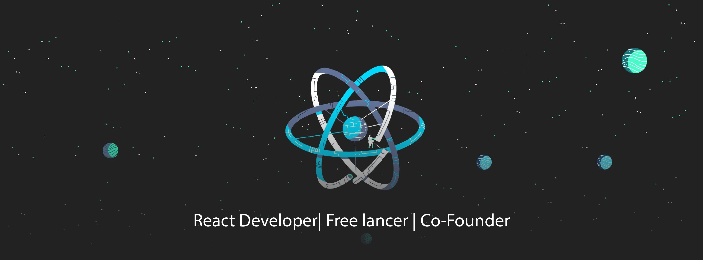

  

<h1 align="center">👋 Hey, I’m Mohamud Abshir</h1>

  🇸🇴 Full Stack & Systems Developer | Rust & Python Enthusiast | Open Source Lover

---

## 💼 About Me  
I’m a Full Stack Developer from **Mogadishu, Somalia** who loves solving meaningful problems with code. I build scalable web applications, design sleek user interfaces, and create cross-platform desktop tools. I've worked with agencies and startups remotely, and I enjoy collaborating with talented developers around the world.

My passion spans from web frameworks to native systems — always with clean, maintainable code and modern tooling.

---

## 🛠️ Tech Stack

  <!-- Frontend -->
  
  
  

  <!-- Backend -->
  
  
  
  

  <!-- Systems -->
  
  
  

  <!-- Styling & Tools -->
  
  

  <!-- Dev Tools -->
  
  
  

---

## 📫 Connect With Me

  
  
  
  

---

## 🔧 What I’m Passionate About
- Building clean, fast user experiences  
- Writing safe and scalable backend systems  
- Exploring Rust & desktop app ecosystems  
- Contributing to open source and helping others grow

---

  Thanks for visiting — let’s build something amazing! 🚀

